##   allure装饰器函数
###  基本说明
-   allure装饰器
    作用：用于将测试用例的数据展示到测试报告中

    导入：import allure 

    说明 ： 

    1.需要将这些装饰器函数添加测试方法或测试类的开头。

    2.同一个类或者一个方法可以添加多个装饰器函数 ，这样此用例就具有了个作用属性 。   
    
###  装饰器函数
| 函数说明 | 备注 | 
| ------- | ------- |
| @allure.epic()|	敏捷中的概念|
|@allure.feature()	|模块名称|
|@allure.story()	|用户故事|
|@allure.title()	|用例标题|
|@allure.severity()	|用例等级|
|@allure.step()	|操作步骤|
|@allure.description()	|测试用例描述|
|@allure.testcase()	|测试用例链接|
|@allure.issue()	|测试 bug 链接|
|@allure.link()	|链接|
|@allure.attachment()	|附件|
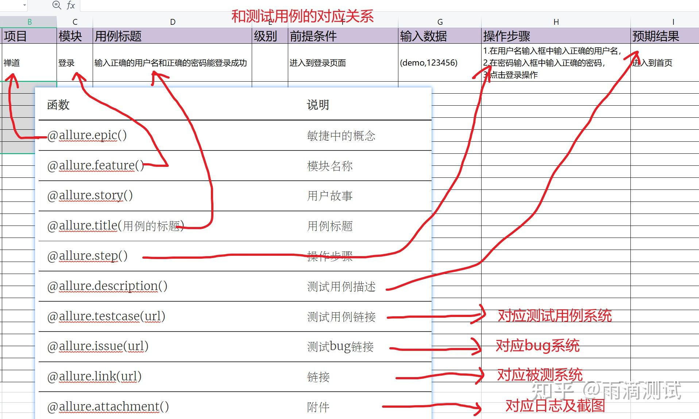

###    如何在脚本中使用
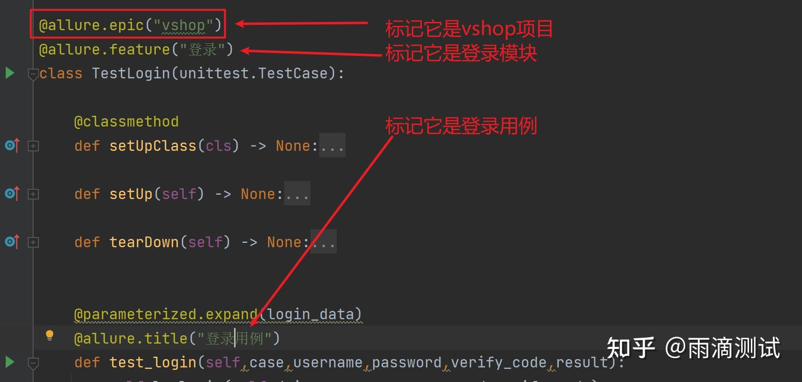
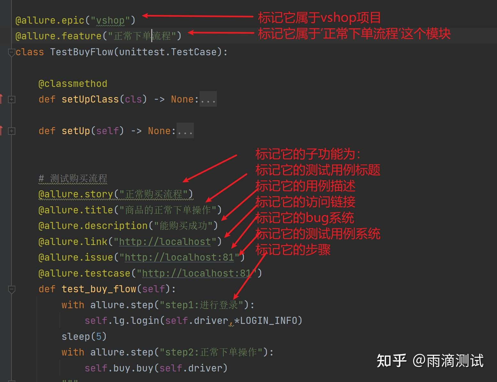

###    使用总结
将我们以上的装饰器整理后就是如下的结构 ，按照此结构可以整理出你的测试用例 。
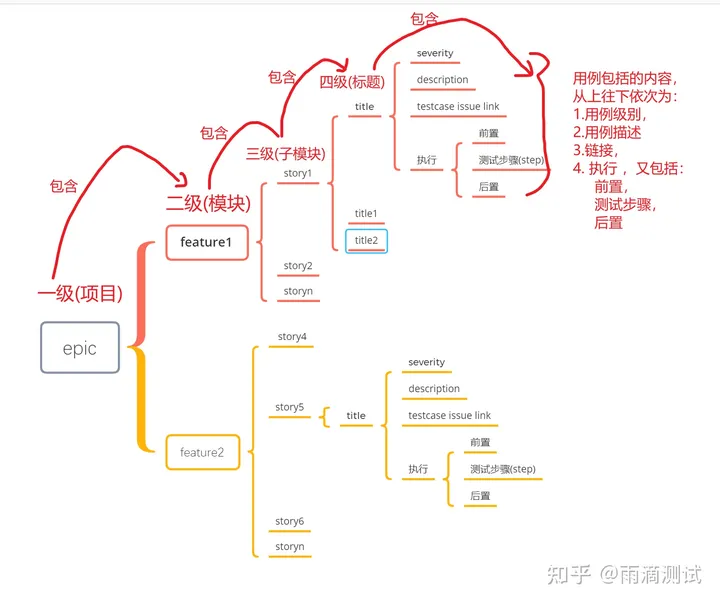
如果你编写的测试用例装饰器函数都已经使用 ，那么它的层级就是如上的结构 ，当然这里还需要说明以下几点 ：

每一个装饰器都是可选项，可加可不加 。比如你把feature去掉了，那么在报告中就不展示这一层级了 ，其它也是如此。
epic、feature、story、title主要用来显示层级 ，而到了title层里，就是显示具体的内容 ，内容包括severity,description,testcase ,issue,link,step等
除了step和attachment比较特殊以外，它们都是放在方法内使用 ，其它的都是标注在测试方法的开头或者类的开头 。
那么，在项目中该怎么组织我们的测试用例呢 ？一般就是按照项目结构一层一层的组织下来 ，比如 ：
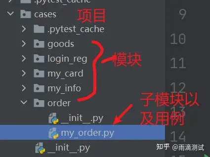

###    命令行参数
allure格式: allure [options] [command] [command options]
第一部分就是options，具体包括如下参数 ：

    Options:
        --help
          Print commandline help.
        -q, --quiet
          Switch on the quiet mode.
          Default: false
        -v, --verbose
          Switch on the verbose mode.
          Default: false
        --version
          Print commandline version.
          Default: false
    

第二部分是command，具体包括：

    generate ：Generate the report
    serve ： Serve the report
    open ：Open generated report
    plugin：Generate the report

以上的命令虽然只有四个，但是每个命令下又都有若干个参数 ，一般加上那个命令，就的加上对应的一些参数 ，这里面我们主要介绍常用的generate命令 。

第三部分是command options，这里主要介绍generate选项 ：

这里主要使用的两个选项就是 ：

-c : 每次生成报告前清除之前生成的报告文件 ，不加此选项则默认为不清除 。

-o : 生成报告的路径 ，也就是你要将测试报告输出到哪里 。

###    生成测试报告
####    整体说明
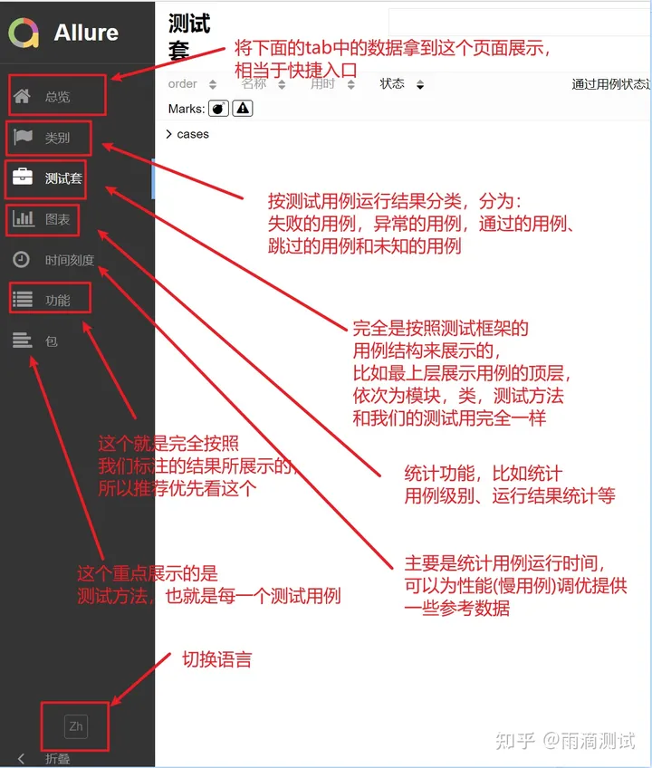
####    总览
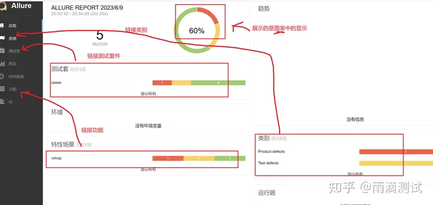
####    类别
所谓类别，就是按照不同用例的运行结果划分的一个分类 ，具体包括 ：

报错的用例

运行失败的用例

运行成功的用例

跳过的用例

未知的用例 

####    测试套
这里的测试套，并不是测试套件 ，它只是按照你项目测试用例的层级一层一层的组织展示的。比如我的代码层级为：

    cases:
        test_login.py
        test_buy_flow.py
        test_reg.py
        
    # test_login.py中的代码为:
    class TestLogin():
        pass

    # test_buy_flow.py中的代码为：
    class TestBuyFlow():
        pass

    # test_reg.py中的代码为
    class TestReg():
    pass
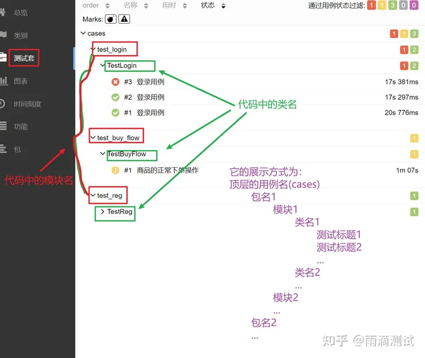

####    图表
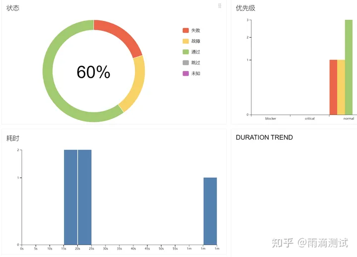
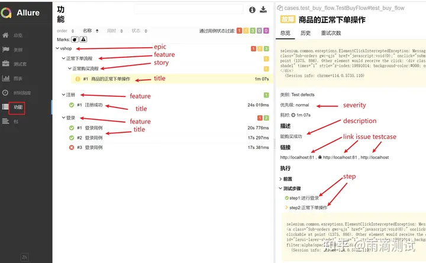
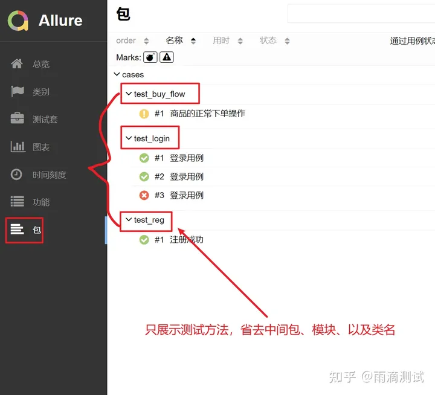

通过上我们可以看到 ，整体来说还是以测试报告的展示为主 ，只不过他的展示维度不同。既然展示维度不同 ，那么查看时更多的结合实际场景来查看，具体可参考如下方式 ：

- 要看总体情况 ，先看总览，可以了解到编写了多少测试用例 ，有多少成功的、多少失败的。

- 运行结果若出现用例运行失败的，报错的，可以查看类别 ，这里按照类别分类 ，查看时更加直观 ，帮助你更快的分析和定位问题。 

- 想查看哪些用例运行速度慢 ，可以看时间刻度，它可以帮你找出运行慢的用例 ，从而可以进行针对性的性能优化 。

- 快速定位是那个用例运行失败的(要定位到测试方法的) ，可以查看包 ，这个能很直观的看到编写了哪些测试方法，那个成功、那个失败 ，结果一目了然 。

- 若想核对你编写的测试用例情况(和测试用例文件核对) ，可以查看功能，因为它是按照项目层级展示，看起来更加直观 。

- 若想从代码角度来看编写的测试用例情况，可以查看测试套 ，因为它就是按照代码层级所展示的 。