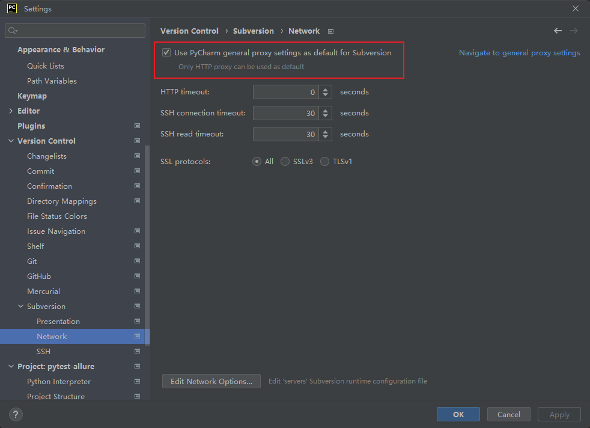

### **pytest运行参数**
pytest 是一个功能强大的 Python 测试框架，支持多种运行参数。下面是一些常用的 pytest 运行参数：
- `-v`：显示测试用例的详细信息，包括测试用例的名称和执行结果。
- `-q`：只显示测试用例的执行结果，不显示详细信息。
- `-k EXPRESSION`：只运行名称中包含指定表达式的测试用例。例如，`pytest -k "test_login"` 只会运行名称中包含 "test_login" 的测试用例。
- `-m MARKEXPR`：只运行带有指定标记的测试用例。例如，`pytest -m smoke` 只会运行带有 "@pytest.mark.smoke" 标记的测试用例。
- `-x`：遇到第一个测试用例失败时停止测试。
- `--maxfail=num`：当测试用例失败的数量达到指定值时停止测试。
- `--tb=style`：设置错误信息的显示格式。可选值包括 "long"（默认值，显示完整的错误信息）、"short"（只显示错误的第一行）、"line"（只显示错误的最后一行）和 "no"（不显示错误信息）。
- `--html=report.html`：生成 HTML 格式的测试报告。
- `--self-contained-html`：生成自包含的 HTML 格式的测试报告，所有的 CSS 和 JavaScript 代码都包含在一个 HTML 文件中，方便分享和查看。
除了上面列出的参数之外，pytest 还支持许多其他的参数，可以通过 `pytest --help` 命令查看完整的参数列表。


### **等待**
在 UI 自动化测试中，等待是非常重要的一步，因为页面元素的加载和响应时间是不可预测的。以下是几种常见的等待方法：

1. 强制等待：使用 time.sleep() 方法来暂停测试执行一段时间。这种方法的缺点是不够灵活，可能会浪费时间，也可能会导致测试失败。

2. 隐式等待：使用 driver.implicitly_wait() 方法来设置全局等待时间。这种方法会在查找元素时等待一段时间，直到元素出现或等待时间结束。这种方法的缺点是可能会导致测试执行时间过长。

3. 显式等待：使用 WebDriverWait 类来等待元素的出现或消失。这种方法可以设置等待时间和等待条件，直到条件满足或等待时间结束。这种方法比较灵活，可以根据需要设置等待时间和条件。

4. Fluent 等待：使用 expected_conditions 类来等待元素的出现或消失。这种方法可以设置等待时间和等待条件，直到条件满足或等待时间结束。这种方法比较灵活，可以根据需要设置等待时间和条件。

需要注意的是，不同的等待方法适用于不同的场景，需要根据具体情况进行选择。在实际应用中，通常会结合多种等待方法来实现更加稳定和可靠的测试。

在 UI 自动化测试中，显示等待是一种常用的技术。它可以帮助我们等待某个条件在一定时间内变为真，然后再执行下一步操作。常见的等待条件包括元素可见、元素可点击、元素存在等等。
在 Selenium 中，可以使用 WebDriverWait 类来实现显示等待。具体实现方法如下：
```python
from selenium.webdriver.support.ui import WebDriverWait
from selenium.webdriver.support import expected_conditions as EC
from selenium.webdriver.common.by import By

# 等待元素可见
wait = WebDriverWait(driver, 10)
element = wait.until(EC.visibility_of_element_located((By.ID, 'element_id')))

# 等待元素可点击
wait = WebDriverWait(driver, 10)
element = wait.until(EC.element_to_be_clickable((By.ID, 'element_id')))

# 等待元素存在
wait = WebDriverWait(driver, 10)
element = wait.until(EC.presence_of_element_located((By.ID, 'element_id')))
```
在上面的代码中，我们首先导入了 WebDriverWait 类和一些常用的等待条件。然后，我们创建了一个 WebDriverWait 对象，并指定了最长等待时间。接着，我们使用 until() 方法来指定等待条件，直到条件成立或者超时为止。最后，我们可以通过返回的元素对象来执行后续的操作。
需要注意的是，显示等待应该尽量避免设置过长的等待时间，否则会影响测试效率。同时，如果等待时间设置过短，可能会导致测试失败。因此，需要根据具体情况来合理设置等待时间。

### **githubpush失败**



### **python的目录操作**
在 Python 中，可以使用 `os` 模块进行目录操作。以下是一些常用的目录操作函数：

1. `os.chdir(path)`：切换当前工作目录到指定路径 `path`。
2. `os.getcwd()`：获取当前工作目录。
3. `os.listdir(path)`：返回指定路径 `path` 下的所有文件和目录的名称列表。
4. `os.mkdir(path)`：创建一个新目录，目录名为 `path`。
5. `os.makedirs(path)`：递归地创建新目录，包括所有必需但不存在的中间目录。
6. `os.rmdir(path)`：删除指定目录，目录必须为空。
7. `os.removedirs(path)`：递归地删除指定目录及其所有子目录，目录必须为空。
8. `os.path.join(path1[, path2[, ...]])`：将多个路径组合成一个路径。

以下是一些示例代码：

```python
import os

# 切换当前工作目录到指定路径
os.chdir('/path/to/directory')

# 获取当前工作目录
current_dir = os.getcwd()

# 返回指定路径下的所有文件和目录的名称列表
dir_contents = os.listdir('/path/to/directory')

# 创建一个新目录
os.mkdir('/path/to/new_directory')

# 递归地创建新目录
os.makedirs('/path/to/new/directory')

# 删除指定目录
os.rmdir('/path/to/directory_to_delete')

# 递归地删除指定目录及其所有子目录
os.removedirs('/path/to/directory_to_delete')

# 将多个路径组合成一个路径
path = os.path.join('/path/to', 'directory', 'file.txt')
```
注意，在 Windows 系统中，路径分隔符为反斜杠 `\`，而在 Linux 和 macOS 系统中，路径分隔符为正斜杠 `/`。为了保证跨平台兼容性，建议使用 `os.path.join()` 函数来拼接路径。